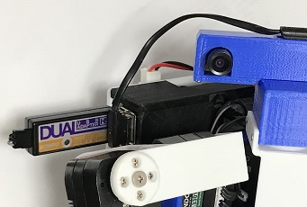

# r2cv-rcb4-humanoid
近藤科学のRCB4とPython ライブラリーを使ってロボットを自律化します。RCB4にて作成されたモーションをPythonから動作させることができるので、Hart2Hartで作成した有用な資産を自律型ロボットで活用することができます。

## R2CV-rcb4-humanoid


[R2CVに戻る](https://github.com/nishibra/r2cv)

## 目次
[1.RasPi4と近藤科学RCB4の接続](#1)

[2.近藤科学USBアダプタの設定](#2)

[3.近藤科学Pythonライブラリー](#3)

<a id="1"></a>
## 1.RasPi4と近藤科学RCB4の接続
まず写真の様にRasPi4にUSBアダプターを接続します。



次にUSBアダプターのコネクターをRCB4miniのcomポートに接続します。
サーボモータ用電源も接続しておきます。


<a id="2"></a>
## 2.近藤科学USBアダプタの設定
近藤科学USBアダプタのドライバをUbuntuにインストールすることでロボットと通信することができるようになります。

> 参考資料 [近藤科学USBアダプタをLinuxで使うには](https://kondo-robot.com/faq/usb_adapter_for_linux_2019)

近藤科学USBアダプタの設定をsystemctlコマンドの作成は以下の手順に従ってください。
### 1).設定実行ファイルを作る。
```
$ sudo gedit /usr/local/bin/kondo.sh
----
#!/bin/sh
while :
do
  modprobe ftdi-sio
  echo 165C 0008 > /sys/bus/usb-serial/drivers/ftdi_sio/new_id
  sleep 30
done
----
```

### 2).サービスを作る。
```
$ sudo gedit /etc/systemd/system/kondo.service
----
[Unit]
Description=hello_world
After=network.service

[Service]
Type=simple
Restart=on-success
ExecStart=/usr/local/bin/kondo.sh

[Install]
WantedBy=multi-user.target
----
```

### 3).実行権限を与える。
```
$ sudo chmod +x /usr/local/bin/kondo.sh
```

### 4).サービスを開始する。
```
$ sudo systemctl start kondo
$ sudo systemctl enable kondo
```

### 5).logを見る。
```
$ sudo journalctl -f -u kondo
```

<a id="3"></a>
## 3.近藤科学Pythonライブラリー
### ライブラリーのインストール
以下よりzipファイルをダウンロードし、必要なフォルダーに解凍すれば使えます。

> 参考資料: [RCB-4 Library for Python ver.1.0.0B](https://kondo-robot.com/faq/rcb-4-library-p100b)

### サンプルプログラムを動作させる。
sampleフォルダーに移動し以下を実行します。
```
$ python3 Rcb4AckTest.py
```

#### <サーボ関連参考資料>
> [PythonでRCB-4をコントロール](https://biped-robot.or.jp/upload/dbmaterials/1019_f36ce68daaa9ad3601ee10511ddd5d2foriginal.pdf)
>
> [RCB-4リファレンスセット Ver.2.0](https://kondo-robot.com/faq/rcb-4-reference-ver-2_0)
> 
> [RCB-4 Library for Python ver.1.0.0B](https://kondo-robot.com/faq/rcb-4-library-p100b)
>
> [RCB-4でモーションとは別に個別にサーボを動かす方法](https://kondo-robot.com/faq/rcb4_motion_ex_servo)
> 
> [RCB-4とRaspberryPiの接続方法](https://kondo-robot.com/faq/raspberrypi_wire_rcb4)
>
> [KONDO KRS Library](http://www.besttechnology.co.jp/modules/knowledge/?KONDO%20KRS%20Library&word=krs)
> 

---

#### (*注)本サイトはMarkdownを使用して作成しています。
> [Qiita Markdown 書き方 まとめ](https://qiita.com/shizuma/items/8616bbe3ebe8ab0b6ca1)
>
> [Markdown記法 チートシート](https://qiita.com/Qiita/items/c686397e4a0f4f11683d)

